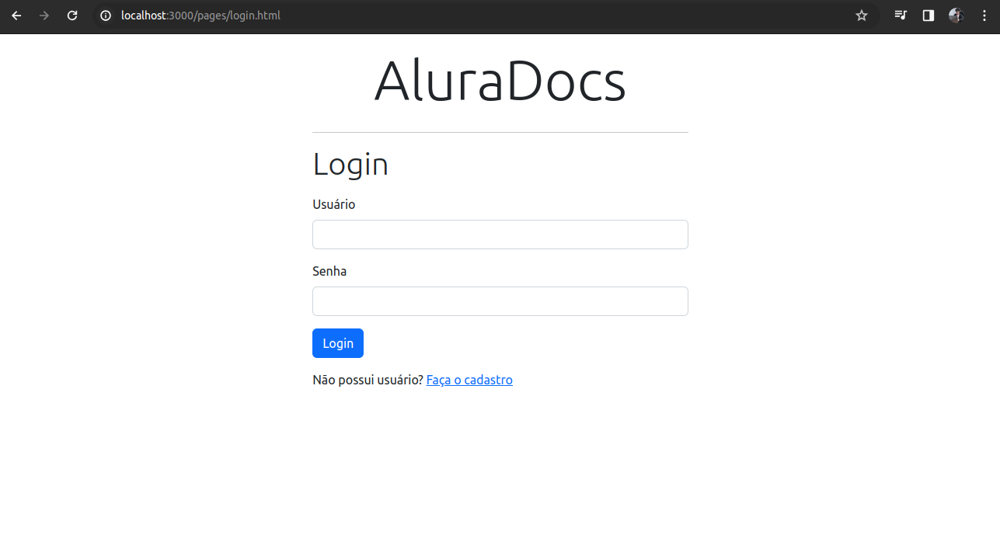

### Projeto Alura Docs - Curso de Websocket - Alura - 2023

### **_Alura Docs_**

#### Sobre o projeto:

- Projeto consiste em desenvolver uma aplicação web e uma API Rest com foco em comunicação em tempo, utilizando Socket.io, express e Typescript.
- Curso tem foca no desenvolvimento de um servidor usando JavaScript puro e MongoDB, mas, optei por utilizando o Typescript para um desenvolvimento mais seguro, além de criar endoinpts(rotas) HTTP com express, vizando utilizando ambos: Websockets e HTTP e um Banco de Dados Relacional PostgreSQL.

### Screenshots do projeto




### Principais tecnologias usadas no desenvolvimento:

- Socket.io
- Express
- Prisma

### Bibliotecas em destaque:

- Socket.io
- Express

### Etapa do desenvolvimento:

- Finalizado

### Passo-a-passo para rodar a aplicação:

1. Entre na pasta alura-docs;
2. use o comando: **_yarn_** ou **_npm install/i_** para instalar os pacotes;
3. use o comando:

```bash
npm run dev
# or
yarn dev
# or
pnpm dev
```
